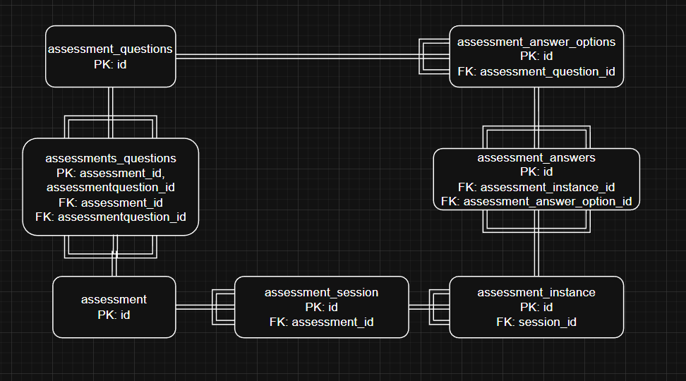

# Solution - Uzaer Shahid

## Phase 1: Entity Relationship Diagram

### Entity Relationship Diagram



### Diagram Description

Assessments have a 1:N relationship with Assessment Sessions.

Assessments have an N:M relationship with Assessment Questions (via assessments_questions).

Assessment Sessions have a 1:N relationship with Assessment Instances.

Assessment Instances have an N:M relationship with Assessment Answer Options (via assessment_answers).

Assessment Questions have a 1:N relationship with Assessment Answer Options.

## Phase 2: getProgressAndScore function

getProgressAndScore() calculates assessment progress and scoring for a single AssessmentInstance.

It returns:

- total number of questions
- number of answered questions
- completion percentage
- total score and maximum score
- normalized percentage score
- per element scoring
- structured questions + answer data

It builds a complete progress report for an assessment attempt.

### Scoring algorithm

Only option based answers are scored. 

The function picks the most recent answer in the instance for each question. That option value is added to totalScore.

For each question, it calculates the question max as the highest option value for that question, usually 5. The max value is added to maxScore.

Each answered question will give at least 1 point since Likert is 1 to 5.

So, in order to generate a percentage, the function normalises by subtracting 1 for each answered question.

The normalised percentage is (normalisedTotalScore/normalisedMaxScore)*100

### Error handling

There are two main categories of error handling I've added to this function:

### 1. Empty/Null Fetch Handling

Currently we are not handling the case that session or assessment are null. If either session or assessment is null, PHP will throw a fatal error.

So I added these safeguards to handle that case smoothly.

```
$session = $instance->getSession();
if (!$session) {
    throw new \RuntimeException('AssessmentInstance has no session.');
}

$assessment = $session->getAssessment();
if (!$assessment) {
    throw new \RuntimeException('AssessmentSession has no assessment.');
}
```

### 2. Exclude Reflection Questions from Scoring

Right now, the function calculates the maxScore even for reflection questions, which is unneeded even if it is 0 for those questions.

So I reordered the skip to be before anything was calculated if isReflectionQuestion is true.

```
if ($question->getIsReflection()) {
    $elementQuestionAnswersData[] = $questionData;
    $questionAnswersData[] = $questionData;
    continue;
}
```

### 3. Ensure questions belong to the current assessment

Currently there is no explicit check to make sure the answer options referenced by an answer are part of the one current assessment's questions.

I added a change so that before scoring a question, this is checked, and it is ignored if so. This can also be changed to be a RuntimeException if it is desired that invalid data is surfaced.

```
if ($answerOption->getAssessmentQuestion()->getId() !== $questionId) {
    continue;
}
```

## Phase 3: POST endpoint for answer submission

Implemented answer submission via a new POST endpoint that records a response against an assessment instance, validates the payload, and persists a new AssessmentAnswer to the database.

### Endpoint

POST /api/assessment/answers

Accepts a JSON request body containing:
- instance_id required
- question_id required
- answer_option_id required for likert questions
- text_answer required for reflection questions
- numeric_value optional when needed

### Implementation details

U AssessmentAnswersController
    - Implemented new controller for handling AssessmentAnswers
    - Fed in the AssessmentService through the construct function
    - Implemented submitAnswer controller function referencing the new POST endpoint
    - submitAnswer function calls the function of the same name in AssessmentService

M AssessmentRepository.php
    - Implemented 3 helper functions to be referenced by submitAnswer, to provide EntityManager access
    - findQuestionById returns the AssessmentQuestion with the corresponding id
    - findAnswerOptionById returns the AssessmentAnswerOption with the corresponding id
    - saveAnswer persists the new answer and then flushes the EM

M AssessmentService.php
    - Implemented submitAnswer function business logic
    - First validates the payload type and nullness
    - Then gets the question and assessment instance, throws error if they don't exist
    - Fetches session and assessment from instance, throws error if they don't exist
    - Throws error if question does not belong to the assessment
    - Retrieves the bool for whether the question is reflection or likert
        - If reflection, then throws error if there is an answerOptionId provided, or if there is no textAnswer provided
        - Vice versa for likert questions
    - Fetches the answerOption for the corresponding id, throws error if there is no corresponding option or if the option doesn't belong to the question
    - Builds a new AssessmentAnswer, passing in the validated instance, answer option, text answer and numeric value to the construct method of the AssessmentAnswer class
    - Calls the saveAnswer method in AssessmentRepository and passes in the new AssessmentAnswer
    - Returns a 'status => created' message if the function reaches the end without error.


### Test Results

```
instance              : @{id=d1111111-1111-1111-1111-111111111111; created_at=2026-03-04 15:42:11;
                        updated_at=2026-03-04 15:42:11; completed=False; completed_at=; responder_name=Test Teacher;
                        element=1.1}
total_questions       : 4
answered_questions    : 3
completion_percentage : 75
scores                : @{element=1.1; total_score=12; max_score=15; percentage=75}
element_scores        : @{1.1=}
insights              : {@{type=completion; message=You have 1 questions remaining to complete this assessment.;
                        positive=False}, @{type=performance; message=You demonstrate strong confidence in this element
                        of teaching practice.; positive=True}}
```

The response from /api/assessment/results/{instanceId} automatically updates the data.

## Task Completed
Full-Stack

## Time Spent
2.5 hours

## Approach + Implementation Details
Implementation listed above, design decisions I made are:
- I preferred to keep all EntityManager calls in the AssessmentRepository, as I felt it was cleaner than injecting it into AssessmentService
- Extensive validation was added not only for ensuring appropriate payload but also to verify the connections between entities as according to the schema.
- In some cases such as in the getProgressAndScore method, I preferred to ignore invalid input (reflection questions being passed in) instead of throwing an exception. This was in situations I preferred to keep the method running to process the data that was valid. In these cases it was better to add an early skip.

## Tools & Libraries Used
- No new libraries used
- Visual Studio Code IDE
- Git & Docker
- AI tool (ChatGPT web client) used for code analysis and understanding. Also used for generating commit message and boilerplate code (to get started).

## Testing
The endpoint can be tested via:
```
curl -X POST http://localhost:8002/api/assessment/answers \
  -H "Content-Type: application/json" \
  -d '{
    "instance_id": "(AssessmentInstance id to access the question)",
    "question_id": "(AssessmentQuestion id to access the answer options)",
    "answer_option_id": "(AssessmentAnswerOption id to update the answer)"
  }'
```

You can verify the answer has been added to the database via:
```
curl http://localhost:8002/api/assessment/results/{AssessmentInstance id}
```

## Challenges & Solutions
Some challenges I faced are:
- Initially it was not clear which entities were 1:1, 1:N and N:M. I narrowed down that those with one foreign key are the many side of 1 to many, those with two are the linking table of many to many, and those with none are only on the 1 side.
- Although the method names and structure of the repo (Controller, Service, Domain) were intuitive, some parts such as the scoring algorithm were not immediately clear, especially the unintuitive normalisation requirement. Careful understanding of how likert questions were scored helped to resolve this.
- Similar to the above, careful understanding of connections between entities resolved the issue of necessary validations to be made between them.

## Trade-offs & Future Improvements
Some future improvements that can be made are:
- Looking at reducing time complexity for the loops in getProgressAndScore
- Saving time in getProgressAndScore if there are 0 questions for the assessment by populating a basic questionData and returning a score of 0, and similar edge case checks
- Altering the schema to have a direct N:1 connection between assessment_answer_options and assessment to ensure each option belongs to that assessment's question set.
- Implementing a scoring system for reflection questions instead of them just being 0.
- Changing the scoring system for likert questions to 0 to 4 to remove the need to normalise.
